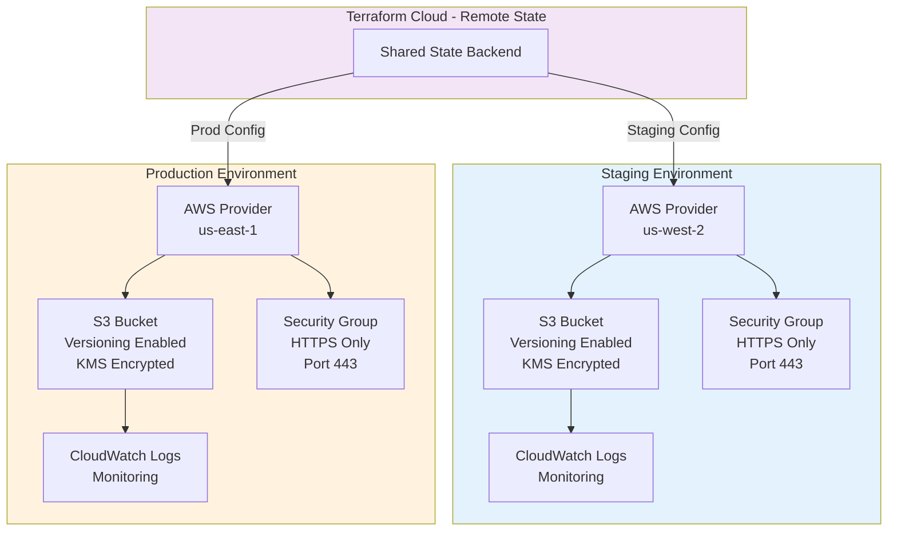

# 🌍 Multi-Environment Infrastructure - CDKTF TypeScript

> **Modular CDKTF** for staging + production with remote state management

[](https://www.terraform.io/cdktf)
[](https://aws.amazon.com/)

## 🎯 Problem
Deploy same infrastructure to staging and production with separate state, separate AWS providers, environment-specific configs.

## 💡 Solution
CDKTF TypeScript with Terraform Cloud remote state, modular stacks, S3 versioning, HTTPS-only security groups.

## 🏗️ Architecture



## 🚀 Quick Deploy
```bash
# Staging
cdktf deploy staging

# Production
cdktf deploy production
```

## 💰 Cost: ~$40-60/month (per environment)
## ⏱️ Deploy: 10-15 minutes

## ✨ Features
- ✅ Staging + Production environments
- ✅ Remote state (Terraform Cloud)
- ✅ Separate AWS providers
- ✅ S3 versioning enabled
- ✅ HTTPS-only security
- ✅ Modular CDKTF code

## 🎯 Perfect For
- Dev/Staging/Prod workflows
- Enterprise deployments
- Team collaboration
- State management

## 👤 Author
**Rahul Ladumor** | rahuldladumor@gmail.com | acloudwithrahul.in

## 📄 License
MIT - Copyright (c) 2025 Rahul Ladumor
